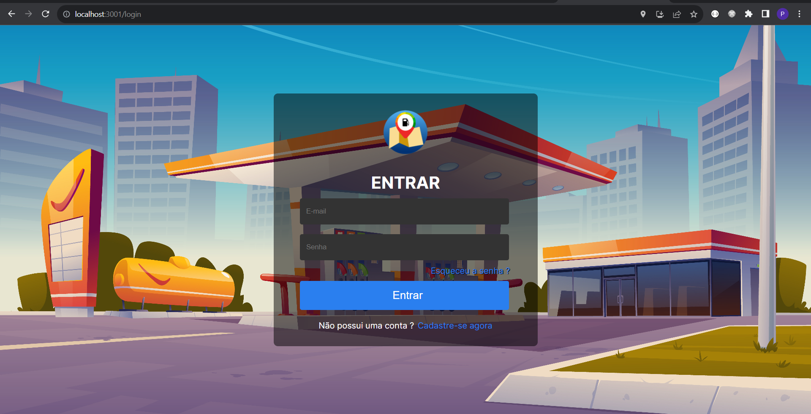
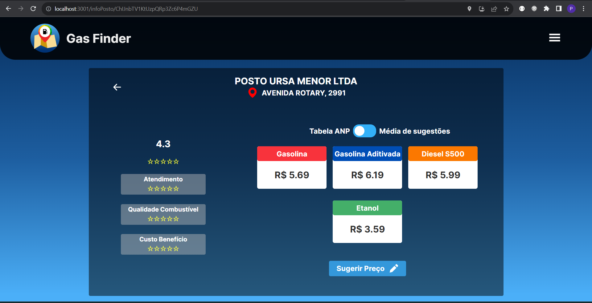
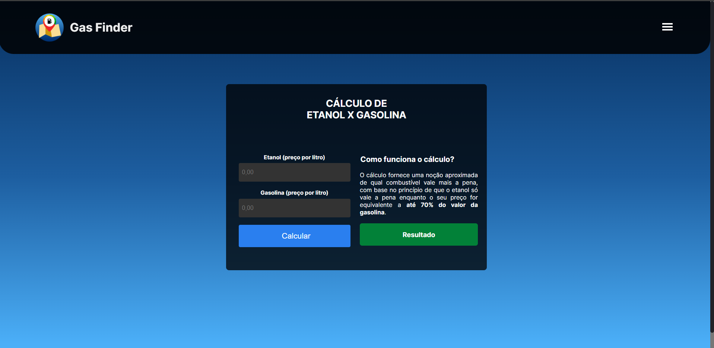
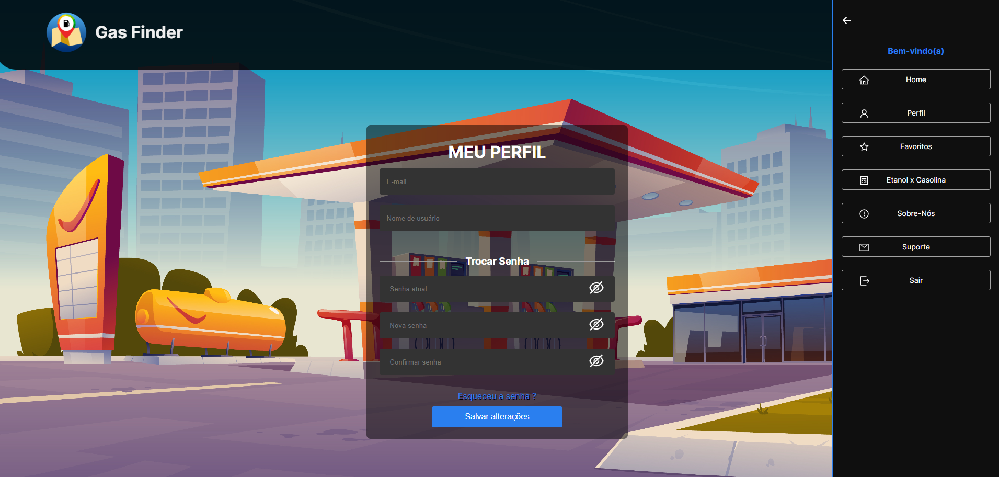
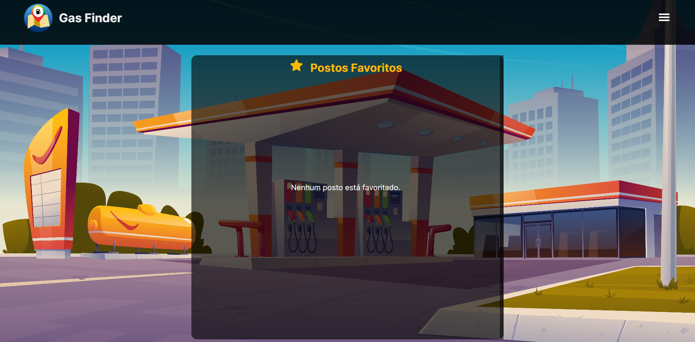

## GasFinder - Gas station price finder and consultant⛽

<h2>Home screen:</h2>

 

<h2>Login:</h2>

 

<h2>Gas station details:</h2>

 

<h2>Calculation of yield between gasoline and ethanol:</h2>

 

<h2>General navigation:</h2>

 

<h2>Favorites:</h2>

 

<h2>About Us:</h2>

 

## 🛠️Technologies

* React.js
* Node.js
* MySQL

## 📞 Contact

📩E-mail: pedrohgs2004@gmail.com  
🌐Linkedin: https://www.linkedin.com/in/phgs2004/
